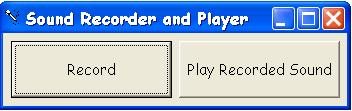



## Sound Recorder and Player

### Description

Recording and playing sound get easier by using API call. Only 2 API call to record and play sound. Please leave comments. Also, don't forget to vote.
 
### More Info
 

             |
---                |---
**Submitted On**   |2003-10-09 20:28:02
**By**             |[Lam Ri Hui](https://github.com/Planet-Source-Code/PSCIndex/blob/master/ByAuthor/lam-ri-hui.md)
**Level**          |Beginner
**User Rating**    |4.8 (19 globes from 4 users)
**Compatibility**  |VB 4\.0 \(16\-bit\), VB 4\.0 \(32\-bit\), VB 5\.0, VB 6\.0
**Category**       |[Windows API Call/ Explanation](https://github.com/Planet-Source-Code/PSCIndex/blob/master/ByCategory/windows-api-call-explanation__1-39.md)
**World**          |[Visual Basic](https://github.com/Planet-Source-Code/PSCIndex/blob/master/ByWorld/visual-basic.md)
**Archive File**   |[Sound\_Reco1656221092003\.zip](https://github.com/Planet-Source-Code/lam-ri-hui-sound-recorder-and-player__1-49125/archive/master.zip)

